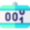
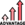

#   JAVASCRIPT COUNTER

Il sito web correlato a questo **README** file contiene un **contatore** con un **valore di default (0)** che può essere **incrementato e decrementato** a proprio piacimento con un **semplice click**.

Inoltre ,se questo non bastasse, il sito presenta anche **altre qualità e caratteristiche**:

##   Vantaggi e proprietà

- Presenza della ***Dark-mode***

- Possibilità di **facilitare alcune operazioni** grazie alla presenza di alcuni **tasti rapidi**

- ***Design responsive*** in base al dispositivo

*Questi sono solo alcuni delle varie proprietà del sito. Per saperne di più, **clicca** [qui](code).*

##   Linguaggi usati

- HTML
- CSS
- SCSS
- Javascript

##   Ringraziamenti
Ringrazio per la **realizzazione del sito** tutte le **risorse che hanno contribuito** a tutto ciò.

Per usufruire di tali risorse non vi basta far altro che **cliccare** alle **parole chiave** sotto evidenziate per andare direttamente alle varie pagine web.
### LOGO E ICONE 
- [Flaticon](https://www.flaticon.com/)
- [Font Awersome](https://fontawesome.com/) 
### IDEA DEL PROGETTO
- [Start2impact](https://www.start2impact.it/)

##   Autore

- [OllenRiot](https://www.github.com/OllenRiot)

##   Licensa 

- [MIT](LICENSE)
